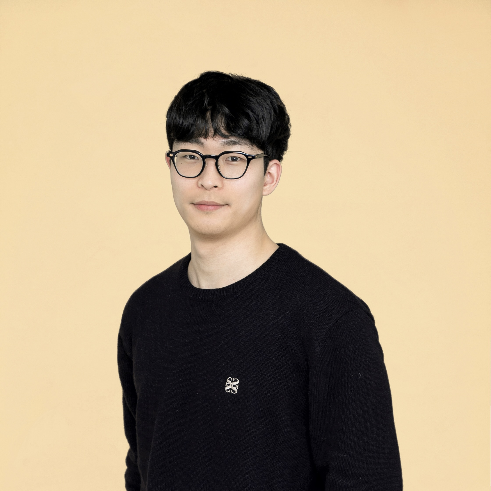

I'm Kyungmin Kim, a Master's student at the Seoul National University (SNU), advised by [Sang-Won Lee](https://swlee69.github.io/).
My research interest is Database Systems.
  
Before joining SNU, I worked at [Kakao Corporation](https://www.kakaocorp.com/page/?lang=ENG&tab=all) as a Data Engineer for three years. 
In 2023, I received my bachelor’s degrees in Computer Science and Engineering at Sungkyunkwan University (SKKU).

# Experiences
- **Graduate Research Assistant** at [SNU VLDB Lab.](https://sites.google.com/view/snu-vldb-lab/home?authuser=0) (Mar. 2025 - Present)
- **Data Engineer** at [Kakao Corporation](https://www.kakaocorp.com/page/?lang=ENG&tab=all) (Dec. 2021 - Feb. 2025)
- **Software Engineer Intern** at [Kakao Corporation](https://www.kakaocorp.com/page/?lang=ENG&tab=all) (Summer, 2021)
- **Undergraduate Research Intern** at Purdue University (Aug. 2018 - Dec. 2018)
- **Undergraduate Research Intern** at SKKU (Mar. 2018 - Aug. 2019)

[[CV]](assets/cv/cv.pdf) / [[Google Scholar]](https://scholar.google.com/citations?user=S643eSgAAAAJ&hl=en) / [[Blog]](https://medium.com/@lufovic77
) / [[Github]](https://github.com/kyungmax) / [[Email]](mailto:kyungminkim@snu.ac.kr)
